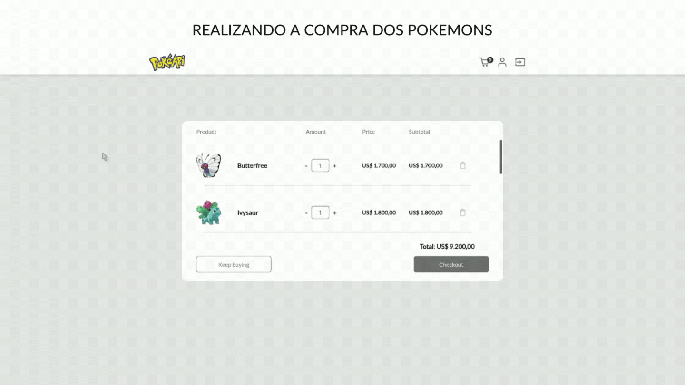
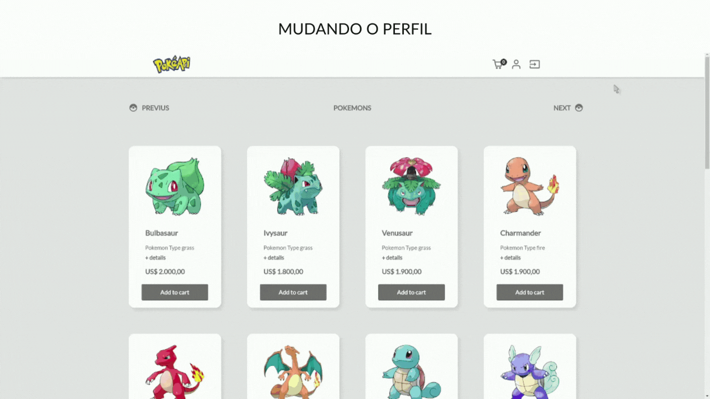

# *Projeto - Pokemon Marketplace*

## Boas-vidas ao repositório do Pokemon Marketplace Accenture

Esse desafio foi proposto pela Accenture durante sua Academia Front-end realizada em Janeiro/2022 no intuito de melhorarmos nossas habilidades voltadas para desenvolvimento front-end com utilização da ferramenta React. Este repositório armazena o projeto final com o desafio resolvido. A proposta do projeto era criar uma plataforma que sirva de marketplace para treinadores de Pokemon, de forma fictícia, em que tivesse todo o processo de autenticação de um usuário, edição do perfil e compra de Pokemons. O objetivo do case era termos contato e experiência de trabalho na simulação de um entregável na empresa com base nas ferramentas apresentadas durante a capacitação. Foi entregue um [Mock-Up](https://www.figma.com/file/xfU3xbCtLc5ZROkBO8EHXO/Pokemon-Marketplace?node-id=0%3A1) para servir de guia na programação da aplicação. A aplicação Pokemon Marketplace pode ser acessada a partir desse [link](https://pokemon-marketplace-accenture.herokuapp.com/).

### As ferramentas principais utilizadas no front-end foram:

[React](https://reactjs.org/)<br>
[Formik](https://formik.org/)<br>
[Git](https://git-scm.com/)<br>
[ESLint](https://eslint.org/)<br>
[Tailwind.css](https://tailwindcss.com/)<br>
[Styled Components](https://www.styled-components.com/)<br>
[Redux](https://redux.js.org/)<br>

### Requisitos técnicos
- Front-End em React;
- Back-End simulado ou criado para autenticação;
- Uso da API Pokedex;

### Funcionalidades
- Efetuação de cadastro;
- Acesso através da página de login;
- Possibilidade de alteração de senha;
- Visualização do perfil do usuário; 
- Visualização de listagem de Pokémons (com paginação):
- Visualização de detalhes do Pokémon;
- Visualização do carrinho de compras (com incremento e decremento de quantidades e valores unitários e total da compra).

---

## Sumário

- [Organização do Projeto](#organização-do-projeto)
- [Desenvolvimento do Back-End](#desenvolvimento-do-back-end)
- [Como Instalar e rodar a aplicação localmente](#como-instalar-e-rodar-a-aplicação-localmente)
- [Usando a plataforma](#usando-a-plataforma)
  - [Primeiro Contato com a Plataforma](#primeiro-contato-com-a-plataforma)
  - [Registro](#registro)
  - [Mudança de Senha](#mudança-de-senha)
  - [Interação com a Home](#interação-com-a-home)
  - [Compra do Pokemon](#compra-do-pokemon)
  - [Mudando o Perfil](#mudando-o-perfil)
  - [Realizando o Logout e Gerando erro 404](#realizando-o-logout-e-gerando-erro-404)
- [Link para o deploy da Plataforma](#link-para-o-deploy-da-plataforma)


---


## Organização do Projeto:

O projeto foi feito seguindo o Kanban, que pode ser visto como um processo ágil e transparente na organização dos projetos de desenvolvimento e foi muito útil para o time no fluxo de trabalho e na divisão de tarefas. Você pode visualizar o Kanban que a equipe utilizou no Trello neste [link](https://trello.com/b/7hDBdAaz).

## Desenvolvimento do Back-End:

A parte de autenticação do usuário, registro e atualização da senha, era uma parte opcional do projeto. A equipe optou por criar uma API do zero feita em Java. Ficou responsável por uma única pessoa, a Eduarda Wiltiner, já que ela demonstrou interesse em demonstrar as habilidades full-stack. O respositório e as ferramentas utilizadas para a criação do processo de autenticação do usuário através de uma API Java está registrado no repositório [API Auth Java](https://github.com/dudawiltiner/api-auth-java). A documentação da API tbm pode ser acessada [aqui](https://api-auth-java.herokuapp.com/swagger-ui.html) para mais detalhes.

## Como Instalar e rodar a aplicação localmente:

### 1. Clone do Repositório

Após cada um dos passos a seguir, haverá um exemplo do comando a ser digitado para fazer o que está sendo pedido.

1.1. Abra o terminal e crie um diretório no local de sua preferência:
**mkdir** pokemon-project:

```javascript
  mkdir pokemon-project
```

1.2. Entre no diretório que acabou de criar e depois clone o projeto:

```javascript
  cd pokemon-project
  git clone https://github.com/dudawiltiner/desafio-frontend-ebytr.git
```
### 2. Instalação da Dependências

2.1. Entre no diretório criado após a clonagem do repositório.

```javascript
  cd pokemon-marketplace-accenture
```

2.2. Instale todas as dependências usando o CLI npm:

```javascript
  npm install
```

### 4. Inicie a aplicação

4.1. Abra no ambiente de desenvolvimento de sua preferência. No caso de uso do VSC, digite o comando **code .** na raiz do diretório clonado.

```javascript
  code .
```
4.2. Rode a aplicação com o node.js, usando o CLI **npm**.

```javascript
  npm start
```
-> Uma janela irá abrir no seu navegador

**OBS**: **Certifique-se** de usar umas dessas **urls("http://localhost:3000", "http://localhost:3001", "http://localhost:8080")** ara poder ter acesso a API de autenticação durante o uso da aplicação, fazendo com que tudo ocorra bem.

## Usando a plataforma: 

Logo abaixo, se encontra uma breve explicação da experiência do usuário com a plataforma e suas diferentes interações e geração de eventos em cada página. 

### Primeiro Contato com a Plataforma: 

Ao rodar a aplicação pela primeira vez e acessar o Pokemon Marketplace, você será redirecionado para a tela de Login. E se não tiver o cadastro, você pode acessar a página de Registro para salvar o seu usuário pela API de Autenticação.

<div align="center">
  
</div>

### Registro: 

Na Página Register você poderá realizar o seu cadastro  e ser redirecionado logo em seguida para a tela de Login.  Você pode ter que esperar alguns segundos para salvar o usuário pois no ato você pode estar acordando a API hospedada no Heroku para então ela receber as requisições.

<div align="center">
  
</div>

### Mudança de Senha:

Se esqueceu da senha, não tem problema! Você pode registra-lá novamente no formulário de Mudança de Senha.

<div align="center">
  
</div>

### Interação com a Home:

Na Home é onde se encontram todos os Pokemons com os seus respectivos preços, tipos e detalhes. Você pode adicionar um Pokemon ao carrinho e perceber que ele está sendo contabilizado no contadador logo acima do ícone de carrinho no navbar. Se tentar colcar mais um pokemon igual ele não irá somar a quantidade colocada na lista de compras. A quantidade pode ser alterada no shopping cart ao clicar no carrinho.

<div align="center">
  
</div>

### Compra do Pokemon:

Ao clicar no carrinho você encontrará uma página com todos os pokemons escolhidos sem duplicidade e com seus respectivos preços e subtotais. Nesta mesma página, você poderá finzalizar a compra. Finalizando a compra, o carrinho ficará vazio novamente e aparecerá uma mensagem no lugar da lista de compras confirmando que não há Pokemons escolhidos.

<div align="center">
  
</div>

### Mudando o Perfil:

Não gostou da foto que ficou no seu perfil? Vai lá no navbar e clica no ícone de usuário para mudar! Você encontrará uma página onde você pode alterar qualquer informação que não seja senha e email registrada durante o cadastro do seu perfil.

<div align="center">
  
</div>

### Realizando o Logout e Gerando erro 404:

Por fim, quando não precisar mais estar logado(a) você pode sair da plataforma, clicando no ícone de saída no navbar. Lembre-se que ao sair você não terá mais acesso a Home, ShoppingCart e Profile pois não estará autenticado(a) no sistema. E é claro que sempre pode surgir aquela curiosidade de mexer na url na sua barra de pesquisa do navegador para escrever alguma rota nova ou até mesmo digitar o nome errado para acessar uma página existente, mas sempre que surgir um desses casos será gerado um erro 404, informando que a página não existe e você poderá navegar para home novamente. 

<div align="center">
  
</div>

## Link para o deploy da Plataforma:
https://pokemon-marketplace-accenture.herokuapp.com/


